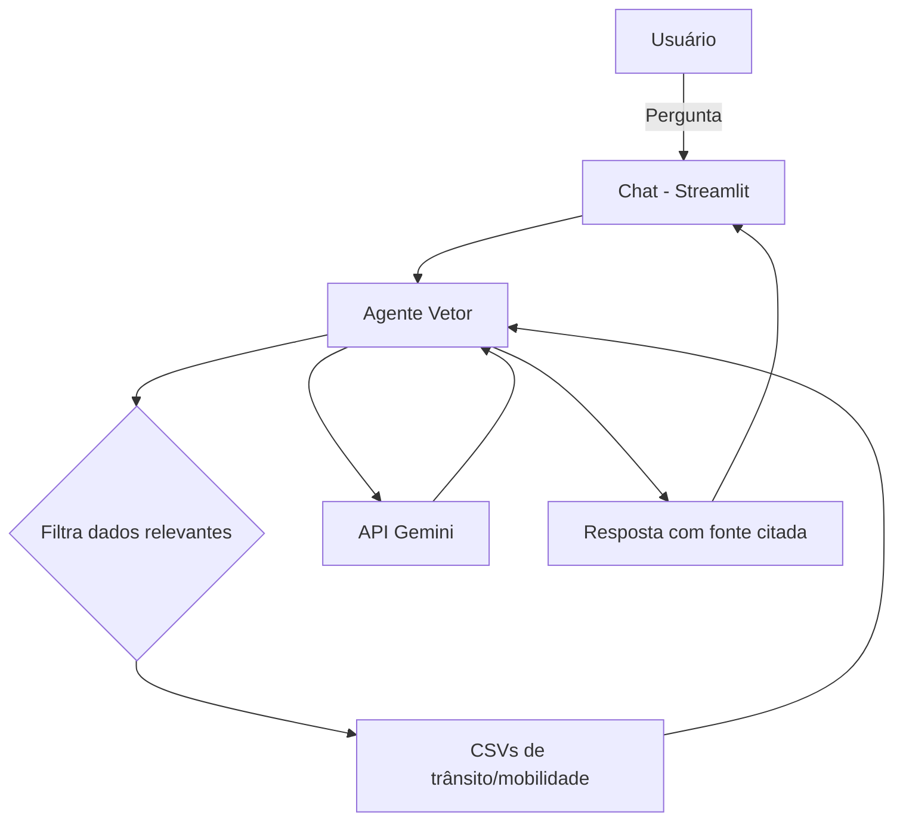

# 🚦 Vetor — Agente de Mobilidade Urbana de Praia Grande

Agente de inteligência artificial que responde perguntas em linguagem natural sobre trânsito, transporte público, frota de veículos e infraestrutura viária de **Praia Grande** e da **Região Metropolitana da Baixada Santista (RMBS)**, com base em dados públicos oficiais.

Projeto adaptado a partir do desafio [dio-lab-bia-do-futuro](https://github.com/digitalinnovationone/dio-lab-bia-do-futuro) (originalmente voltado a um agente financeiro), trocando o domínio para dados abertos de mobilidade urbana.

🔗 **App no ar:** [agente-transito-praia-grande.streamlit.app](https://agente-transito-praia-grande-hz5muazanil7tgqdmec6mm.streamlit.app)

---

## O Problema

Os dados públicos de trânsito de Praia Grande existem, mas estão espalhados em dezenas de planilhas no [Portal de Dados Abertos da Prefeitura](https://dadosabertos.praiagrande.sp.gov.br/geonetwork/srv/por/catalog.search). Acidentes, frota de veículos, transporte coletivo, ciclovias, cada um em um arquivo separado. Cruzar essas informações manualmente exige tempo e conhecimento técnico que a maioria dos cidadãos, jornalistas e pesquisadores não tem.

## A Solução

O **Vetor** consulta sete bases de dados oficiais e responde perguntas como *"quantos acidentes aconteceram no meu bairro em 2023?"* ou *"como está a frota de veículos da cidade?"*. Sempre citando a fonte e o ano exatos, sem inventar números, sem fazer previsões e sem opinar sobre gestão pública.

---

## Dados Utilizados

Extraídos do Portal de Dados Abertos da Prefeitura de Praia Grande:

| Arquivo | Cobertura |
|---|---|
| `Acidentes por Bairro e por Ano_Praia Grande.csv` | Acidentes de trânsito por bairro, por ano |
| `Acidentes Bairro Mês.csv` | Acidentes de trânsito por bairro, por mês |
| `Índice de Acidentes_Praia Grande.csv` | Indicadores agregados de segurança viária |
| `Frota de veiculos por tipo_PG_RMBS.csv` | Frota de veículos por tipo (PG e RMBS) |
| `Transporte intermunicipal.csv` | Linhas, frota e passageiros do transporte coletivo |
| `Infraestrutura cicloviária_Praia Grande.csv` | Extensão de ciclovias e ciclofaixas |
| `Tipo de vias_Praia Grande.csv` | Extensão de vias abertas e pavimentadas |

Mais detalhes em [`docs/02-base-conhecimento.md`](./docs/02-base-conhecimento.md).

---

## Arquitetura



O agente carrega os CSVs, filtra as linhas relevantes conforme palavras da pergunta (bairro, ano, tema) e envia apenas esse recorte ao modelo, evitando estourar o contexto e mantendo as respostas ancoradas nos dados reais. Detalhes em [`docs/01-documentacao-agente.md`](./docs/01-documentacao-agente.md).

---

## Stack

| Camada | Ferramenta |
|---|---|
| Interface | [Streamlit](https://streamlit.io/) |
| LLM | [API Gemini](https://ai.google.dev/) (`google-genai`, camada gratuita) |
| Dados | Python + [pandas](https://pandas.pydata.org/) |
| Hospedagem | [Streamlit Community Cloud](https://streamlit.io/cloud) |

Todo o projeto foi construído com ferramentas gratuitas, sem custo de infraestrutura, tornando o modelo replicável para outros municípios com portais de dados abertos.

---

## Estrutura do Repositório

```
📁 agente-transito-praia-grande/
│
├── 📄 README.md
│
├── 📁 data/                                   # CSVs de trânsito e mobilidade
│   ├── Acidentes por Bairro e por Ano_Praia Grande.csv
│   ├── Acidentes Bairro Mês.csv
│   ├── Índice de Acidentes_Praia Grande.csv
│   ├── Frota de veiculos por tipo_PG_RMBS.csv
│   ├── Transporte intermunicipal.csv
│   ├── Infraestrutura cicloviária_Praia Grande.csv
│   └── Tipo de vias_Praia Grande.csv
│
├── 📁 docs/                                   # Documentação do projeto
│   ├── 01-documentacao-agente.md              # Caso de uso, persona e arquitetura
│   ├── 02-base-conhecimento.md                # Fonte e estratégia dos dados
│   ├── 03-prompts.md                          # System prompt e edge cases
│   ├── 04-metricas.md                         # Testes e resultados de avaliação
│   └── 05-pitch.md                            # Roteiro do pitch
│
├── 📁 src/                                    # Código da aplicação
│   ├── app.py                                 # Interface de chat (Streamlit)
│   ├── agente.py                              # Lógica do agente e chamada à API
│   ├── config.py                              # Leitura da chave da API (secrets)
│   └── requirements.txt                       # Dependências
│
└── 📁 assets/                                 # Vídeo de pitch e materiais de apoio
```

---

## Rodando Localmente

```bash
git clone https://github.com/patriciacmoreno/agente-transito-praia-grande.git
cd agente-transito-praia-grande
pip install -r src/requirements.txt
```

Crie um arquivo `.streamlit/secrets.toml` com sua chave gratuita do Gemini (gerada em [aistudio.google.com/apikey](https://aistudio.google.com/apikey)):

```toml
GEMINI_API_KEY = "sua-chave-aqui"
```

Depois, rode:

```bash
streamlit run src/app.py
```

---

## Avaliação

O agente foi testado com 14 perguntas cobrindo Assertividade, Segurança e Coerência resultando em todas aprovadas. Resultados completos e limitações conhecidas em [`docs/04-metricas.md`](./docs/04-metricas.md).

---

## Limitações Declaradas

- Não faz previsões futuras sobre acidentes ou mobilidade;
- Não emite opinião sobre políticas públicas ou gestão municipal;
- Não possui dados em tempo real, apenas os históricos publicados no portal;
- Cobre apenas Praia Grande e, parcialmente, a RMBS.

---

## Créditos

Projeto desenvolvido por [Patrícia Moreno](https://github.com/patriciacmoreno) a partir do desafio da [Digital Innovation One](https://github.com/digitalinnovationone/dio-lab-bia-do-futuro), com dados do [Portal de Dados Abertos da Prefeitura de Praia Grande](https://dadosabertos.praiagrande.sp.gov.br/).
