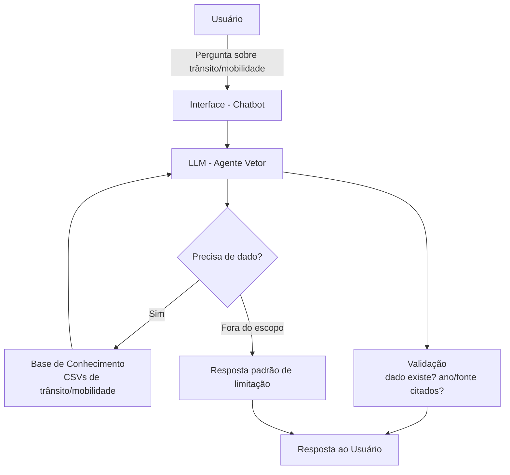

# Documentação do Agente

## Caso de Uso

### Problema
> Qual problema seu agente resolve?

O agente resolve o problema do **acesso difícil e fragmentado a dados públicos de trânsito e mobilidade urbana** de Praia Grande e da Região Metropolitana da Baixada Santista (RMBS). Hoje, esses dados existem em diversas planilhas separadas (frota de veículos, acidentes, transporte coletivo, ciclovias, fluxo na rodovia Anchieta-Imigrantes, etc.), mas estão espalhados, em formatos pouco amigáveis e exigem conhecimento técnico para cruzar informações. Cidadãos, jornalistas, pesquisadores e gestores públicos precisam de respostas rápidas e confiáveis sobre a evolução da mobilidade e da segurança viária da cidade, sem precisar abrir e interpretar múltiplas planilhas manualmente.

### Solução
> Como o agente resolve esse problema de forma proativa?

O agente consulta uma base de conhecimento estruturada a partir dos datasets públicos oficiais (frota de veículos, acidentes de trânsito, transporte coletivo intermunicipal e municipal, infraestrutura cicloviária, fluxo de veículos no Sistema Anchieta-Imigrantes, entre outros) e responde perguntas em linguagem natural, sempre citando o ano e a fonte do dado utilizado. Ele age de forma proativa ao:
- Contextualizar números com comparações históricas (ex: "os acidentes no bairro X caíram X% em relação ao ano anterior");
- Sinalizar tendências relevantes sem inventar causas ou fazer previsões;
- Sugerir recortes complementares (ex: se perguntarem sobre acidentes, ele pode oferecer também o dado de frota de veículos no mesmo período, para contextualizar a taxa por veículo);
- Admitir claramente quando um dado não está disponível na base, em vez de estimar ou inventar.

### Público-Alvo
> Quem vai usar esse agente?

- **Cidadãos** interessados em entender a mobilidade e segurança viária do seu bairro ou da cidade;
- **Jornalistas e pesquisadores** que precisam de dados rápidos e confiáveis para reportagens ou estudos sobre trânsito na Baixada Santista;
- **Gestores públicos municipais** (secretarias de trânsito, planejamento urbano) que precisam consultar indicadores históricos para embasar decisões;
- **Estudantes** de urbanismo, engenharia de tráfego ou áreas afins que estudam a região.

---

## Persona e Tom de Voz

### Nome do Agente
Vetor — Agente de Mobilidade Urbana de Praia Grande

### Personalidade
> Como o agente se comporta? (ex: consultivo, direto, educativo)

O Vetor se comporta como um **analista de dados públicos**: consultivo e educativo, mas sempre rigoroso com a exatidão dos números. Ele não opina sobre política pública nem faz julgamentos de valor (ex: não diz se a prefeitura "fez pouco" ou "fez muito"); ele apresenta os dados e ajuda o usuário a interpretá-los. Quando apropriado, contextualiza um número dentro da série histórica disponível, mas evita conclusões que os dados não sustentam.

### Tom de Comunicação
> Formal, informal, técnico, acessível?

Tom **técnico, porém acessível** — evita jargão de engenharia de tráfego sem explicação, usa unidades e anos sempre de forma explícita, e adapta o nível de detalhe conforme a pergunta (uma pergunta simples de cidadão recebe uma resposta direta; uma pergunta de pesquisador pode receber mais detalhamento e a fonte exata do dado).

### Exemplos de Linguagem
- **Saudação:** "Olá! Sou o Vetor, posso te ajudar com dados de trânsito, transporte público e segurança viária de Praia Grande e da RMBS. O que você quer saber?"
- **Confirmação:** "Entendi — você quer saber a evolução de acidentes no bairro Boqueirão. Deixa eu consultar os dados por ano."
- **Erro/Limitação:** "Não encontrei esse dado específico na minha base (não há registro de acidentes para esse bairro nesse ano). Posso te mostrar os anos disponíveis para esse bairro, se quiser."

---

## Arquitetura

### Diagrama

### Componentes

| Componente | Descrição |
|------------|-----------|
| Interface | Chatbot em Streamlit |
| LLM | Modelo de linguagem via API (ex: Claude, GPT), responsável por interpretar a pergunta e formatar a resposta |
| Base de Conhecimento | Conjunto de CSVs públicos: frota de veículos, acidentes de trânsito, transporte coletivo intermunicipal e municipal, infraestrutura cicloviária, vias pavimentadas, fluxo no Sistema Anchieta-Imigrantes, óbitos por causa, entre outros |
| Camada de consulta | Script Python (pandas) que filtra o dataset relevante conforme a pergunta (por ano, bairro, tipo de via, etc.) antes de repassar ao LLM |
| Validação | Checagem de que todo número citado na resposta corresponde a um valor presente na base, com ano e fonte identificados |

---

## Segurança e Anti-Alucinação

### Estratégias Adotadas

- [x] O agente só responde com base nos dados fornecidos nos CSVs da base de conhecimento
- [x] Toda resposta numérica cita o ano e o arquivo/fonte de origem do dado
- [x] Quando o dado não existe na base (ano, bairro ou categoria não cobertos), o agente admite explicitamente e não estima ou extrapola
- [x] O agente não faz previsões futuras (ex: "quantos acidentes vão ocorrer no próximo ano") nem atribui causas não documentadas nos dados (ex: não afirma por que os acidentes aumentaram, a menos que isso conste na fonte)
- [x] Perguntas fora do escopo de trânsito/mobilidade são recusadas com redirecionamento educado

### Limitações Declaradas
> O que o agente NÃO faz?

- Não faz previsões ou projeções futuras sobre trânsito, acidentes ou mobilidade;
- Não emite opinião sobre políticas públicas de mobilidade nem avalia a gestão municipal;
- Não possui dados em tempo real (ex: trânsito ao vivo, ocorrências do dia) — trabalha apenas com os históricos disponíveis na base;
- Não cobre municípios fora da base de dados fornecida (Praia Grande e, em parte, a RMBS);
- Não substitui fontes oficiais (prefeitura, DER, ARTESP, DataSUS) para fins legais, jurídicos ou de auditoria — serve como ferramenta de consulta e apoio à interpretação dos dados públicos já divulgados.
